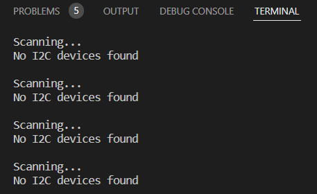

# Pràctica 5a: Busos de comunicació I (introducció i bus I2C)
L'objectiu d'aquesta pràctica és entendre la utilitat i funcionament dels busos de sistemes. Aquests comuniquen el processador amb els diferents perifèrics.

Existeixen dos tips de bus segons com siguin les conexions físiques amb els perifèrics:
* __Bus paral·lel:__ En aquest tipus de bus la informació viatja per bytes sencers al mateix temps, amb l'ajuda de diferents canals que tenen funcions fixes. S'utlitza moltes vegades en el bus del processador, disc dur, etc. El bus en paral·lel és senzill a nivell lógic, però les seves conexions son complexes d'implementar. Aquest implementa els següents canals:

   * d'adressa: per escriure el codi binari de la adressa del perifèric. 
   * de control: envien senyals per arbitrar la comunicació.
   * de dades: per aquests canals s'envien els bits que formen el byte o bytes de dades que es transmeten.

* __Bus en serie:__ En aquest tipus de bus, la informació és enviada bit per bit i és reconstruida per mitjà de registres o rutines. El bus I2C és un exemple d'aquest tipus de bus.
___
## Busos I2C (Inter-Integrated Circuit)
Va ser desenvolupat per Phillips per la comunicació interna de dispositius electronics. Es tracta d'una conexió en sincrona.
Aquest bus només requereix de'una conexió per mitjà de dos canals:

* CLK: canal pel qual s'envia el senyal de rellotge per poder sincronitzar els dispositius que comunica.
* SDA: canal pel qual s'envia la informació que es transmet. Aquesta anirà anirà sincronitzada amb la senyal de rellotge. 
___
## CODI DE LA PRÀCTICA
```
#include <Arduino.h>
#include <Wire.h>

void setup()
{
  Wire.begin();
 
  Serial.begin(115200);
  while (!Serial);             // Leonardo: wait for serial monitor
  Serial.println("\nI2C Scanner");
}
 
 
void loop()
{
  byte error, address;
  int nDevices;
 
  Serial.println("Scanning...");
 
  nDevices = 0;
  for(address = 1; address < 127; address++ )
  {
    // The i2c_scanner uses the return value of
    // the Write.endTransmisstion to see if
    // a device did acknowledge to the address.
    Wire.beginTransmission(address);
    error = Wire.endTransmission();
 
    if (error == 0)
    {
      Serial.print("I2C device found at address 0x");
      if (address<16)
        Serial.print("0");
      Serial.print(address,HEX);
      Serial.println("  !");
 
      nDevices++;
    }
    else if (error==4)
    {
      Serial.print("Unknown error at address 0x");
      if (address<16)
        Serial.print("0");
      Serial.println(address,HEX);
    }    
  }
  if (nDevices == 0)
    Serial.println("No I2C devices found\n");
  else
    Serial.println("done\n");
 
  delay(5000);           // wait 5 seconds for next scan
}
```
Per exemple, si executem el codi sense cap perifèric conectat mitjançant el bus I2C veurem el següent pel terminal:

